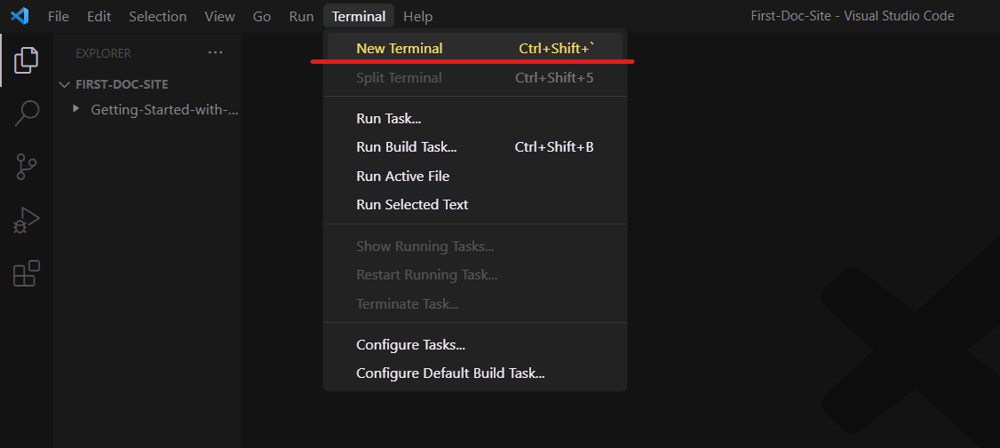

## Setup

Now that you have Python and pip installed, the next step is to install MkDocs. Follow the steps below.

1. **Type** this command in your terminal or command prompt:

   ```
   pip install mkdocs
   ```

   Confirm the complete MkDocs installation by typing this command:

   ```
   mkdocs --version
   ```

2. **Create** a new folder for your project on your desktop.
3. **Right-click** on the newly created folder and choose 'Show more options'.
4. **Click** 'Open with Code' to open your VSCode.
5. **Click** on the terminal and select 'New Terminal'.



6. **Create** a new MkDocs project by typing in the command below in the opened terminal.

   ```
   mkdocs new my-project // ‘my-project’ can be any name
   ```

7. **Navigate** to your new project folder by typing the following command:

   ```
   cd my-project
   ```
