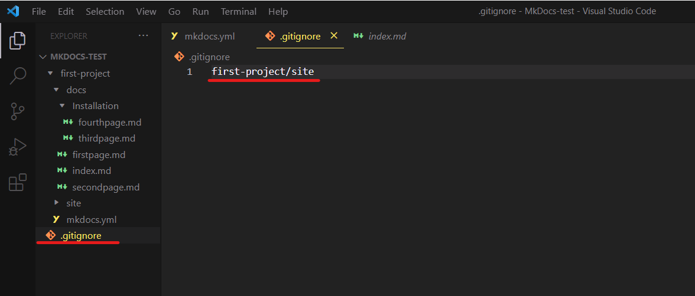

# Building and Deploying Your Site

This process makes your MkDocs site live and accessible to people. To get started:

- **Create** a GitHub account on the [website](https://github.com/).
- **Create** a new repository on GitHub. For more information, see [Create a Repo](https://docs.github.com/en/get-started/quickstart/create-a-repo).
- **Push** your site to this new repository by typing these commands after each other in your terminal.

```
  git init
  git add . //Ensure to add a space after ‘add’
  git commit -m "First commit"
  git remote add origin https://github.com/DrVickie8/MkDocsTest.git
  git push -set-upstream origin master
```

- **Type** in your terminal and wait for a few seconds
  ```
  mkdocs gh-deploy
  ```
- **Create** a new file called `.gitignore`, add the newly created folder `site` as seen below and save changes.



> _Your_ `first-project` _is the name of the folder the_ `site` _folder is in._

- **Repeat** the commands below.

```
  git init
  git add .gitignore //Ensure to add a space after 'add'
  git commit -m "Fix: Adding .gitignore file"
  git push
```

- **Go** to your GitHub repository and refresh the page.
- **Scroll down** to the ‘Environment’ section and click ‘github-pages'
- **Click** ‘View deployment’, and your MkDocs site is now available.

---

## Note:

- When you want to make changes to your site, you will delete the `gh-pages` branch by using the `git push origin --delete gh-pages` command in your terminal.

- After you have made the changes, delete the `site` directory and type `mkdocs gh-deploy` to deploy the site.

---
