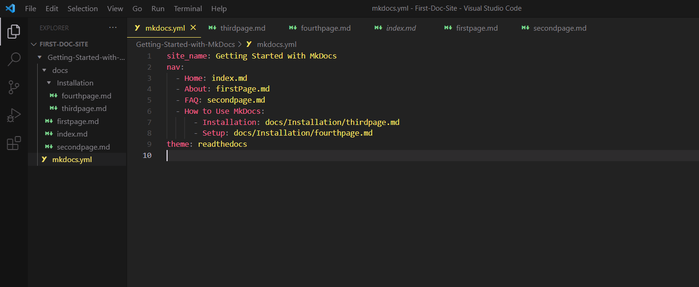

# How to use MkDocs themes

MkDocs offers a range of themes for customizing your site. With these themes, you can change the look and styling of your site. They are

1.  **Built-in themes** include the default MkDocs, which does not require installation, and Read the Docs. Follow the steps to use the Read the Docs theme:

    - **Open** the `mkdocs.yml` file, type in `theme`, and set the value to `readthedocs`.
      ```
      theme: readthedocs
      ```
    - **Save** the changes in the `mkdocs.yml` file.
      

2.  **External themes** offer additional customization options and styles. Follow these steps to get started:

    - **Find** an external theme on [GitHub](https://github.com/mkdocs/mkdocs/wiki/MkDocs-Themes) and install it according to the instructions in the documentation.
    - In your `mkdocs.yml` file, **type** in
      ```
      theme:[themeName]
      ```
    - **Explore** the customization options of your preferred theme.
