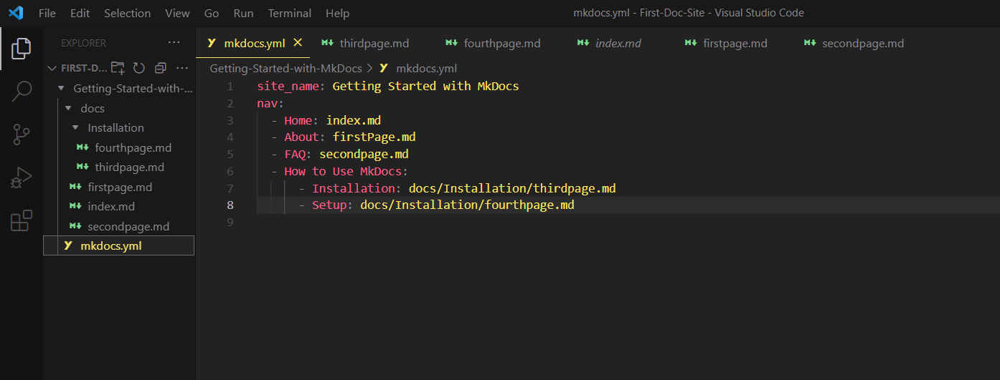

# Writing

Using MKDocs is easy—you don't need coding experience. All your content is in the Docs folder.

## Getting Started

- To get started, type this command in your terminal.
  ```
  cd my-project //  Use the name for your project
  ```
- For a preview of your site, start the server by running the command
  ```
  mkdocs serve
  ```
- **Click** on ‘Ctrl’ + [`http://127.0.0.1:8000/`](http://127.0.0.1:8000/%60) to view the default web page.


## Making Changes

To make some changes to your site, follow these steps:

1. **Heading**

   - Change the site name in the `mkdocs.yml` file and save your changes.

   ```
   site_name: First Doc Site
   ```

2. **Adding pages**

   - **Navigate** to the `docs/` folder and create new files, for example, [`firstpage.md`](http://firstpage.md) and [`secondpage.md`](http://secondpage.md). See [How to Create Files and Folders in VS Code](https://www.youtube.com/watch?v=_yOqKZbyqrc) for more information.
   - **Type** in your content using Markdown. For more information, see [markdown syntax](https://confluence.atlassian.com/bitbucketserver/markdown-syntax-guide-776639995.html).
   - **Save** your work.
   - **Go** to `mkdocs.yml`, add the newly created files in this format, and save your changes.

```
  site_name: Getting Started with MkDocs
   nav:
     - Home: index.md
     - About: firstPage.md
     - FAQ: secondpage.md
```

3. **Nesting**

- This is grouping pages under a parent page; this makes your site organized and easy to navigate.
- **Create** a new folder in the `docs/` folder; this will be the parent page.
- **Create** new markdown (.md) files in the new folder and add the content or text on these pages.
- **Open** the `mkdocs.yml` file under the `nav` section and add the parent page and its sub-pages in the format below.

  

  > _Remember to indent your YAML file_
